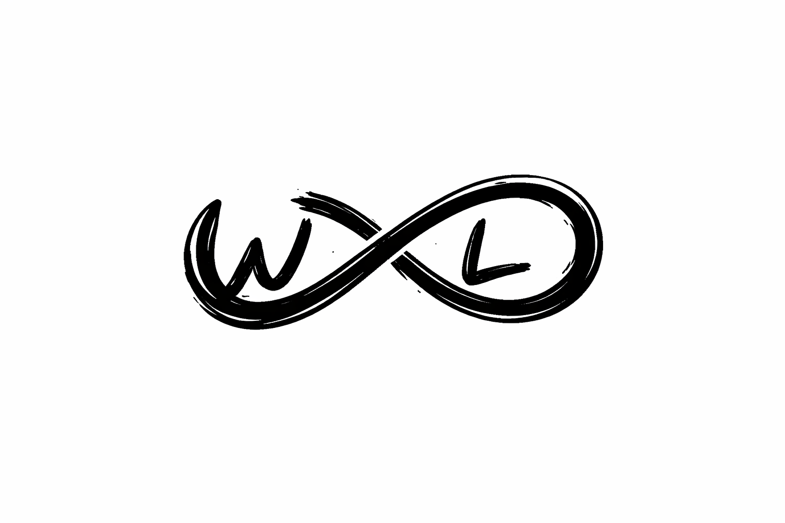

  

# what-the-loop.spec

Standalone specification repository for WhatTheLoop (WTL), a proposed shared
loop interface for agent execution.

## Contents

- `SPEC.md` — primary behavioral specification and minimal CLI contract
- `wtl_engine.qnt` — Quint reference model for engine mechanics
- `wtl_policy_interactive.qnt` — Quint reference model for interactive completion
- `wtl_policy_ralph_wigum.qnt` — Quint reference model for staged delivery
- `wtl_policy_gan.qnt` — Quint reference model for adversarial generation with contract gating
- `wtl_policy_autoresearch.qnt` — Quint reference model for autonomous experiment loops
- `wtl_observer.qnt` — Quint reference model for observer events
- `references/` — LLM-friendly reference material for example agent runtimes

## Notes

- This repository contains the specification and reference artifacts only.
- The Quint models are reference design artifacts; consumers do not need to
  re-run verification unless they want to extend the models.
